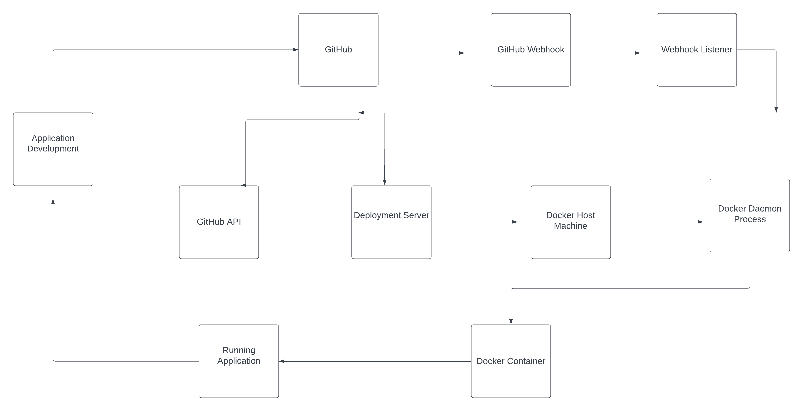

# Project 5

## Austin Duling
## 4/10/2023

# Part 1
## Documentation
- In this section, we are attempting to demonstrate Continuous Deployment for an application we have developed and dockerized. The goal for this project (and CD in general) is to automatically build, test, and deploy the application we have built to the production (docker) every time we make changes in the GitHub repository we have made. The tools we will be using include GitHub actions and DockerHub. The purpose of this project is to demonstrate the importance of establishing a workflow that allows for easier testing, maintenence, and releases of a product. 

- To create a tag in GitHub, you can use the format `git tag <tagname>` to apply the tag to the HEAD of your current repository. To tag a specific commit, you can use: `git tag <tagname> <commitID>`

- A GitHub workflow is a series of actions that will be run whenever an event is detected to have happened within your repository. Workflows can do whatever you want them to as defined using a YAML file that you place in the .github/workflows/ directory in your repository. You can define the events to trigger the workflow as well. These events can include pushing to the repository, pull requests, merging branches, etc.

- https://hub.docker.com/repository/docker/wereshenron/testimage/general

# Part 2
- Within the instance, to install docker I ran the commands: `sudo apt-get update` and `sudo apt-get install docker.io`

- The container restart script is used to grab a new docker image and restart the container using the updated image. First, it pulls the new image using `docker pull`. Then it stops the running container. Next, it removes the container it just stopped. Last, it starts a new container with the new image it just grabbed. You will want to use this type of script after a webhook trigger from GitHub or DockerHub to make sure the product is always current. The script should be stored in a secure directory on the instance wherever the docker container is being executed. In my case, I cloned the repository in `~/git/3120-cicd-wereshenron` and the restart script went in the `deployment` subdirectory. 

- To install `webhook` on my ubuntu instance, I simply ran the command `sudo apt-get install webhook`. To start the webhook service after the reboot of the instance, I ran the command `sudo systemctl start webhook.service`. 

- The webhook task file is a JSON that defines whatever configuration you desire for your webhook service. It can specify things like the command to execute (in this case the restart bash file), and cwd, and hooks configuration file to use. 

- In order to have DockerHub message the listener, You need to set up a listener that can receive webhook messages. You can deploy listeners on a public server or cloud servce like an AWS instance. Then, you can generate the secret key that will be used to authenticate requests from whichever service you are utilizing, GitHub or DockerHub. Next, in the account settings of whicher one you picked, you will create a webhook that points directly to the URL of the listener that you have deployed and supplies the password you have established. Here you can specify which kinds of events you would like to trigger the webhook, like pushes to a repository or images being pushed to DockerHub.

