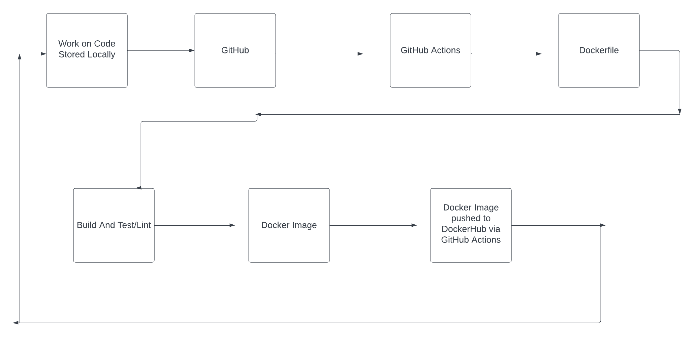

# Project 4

## Austin Duling
## 3/20/2023

# Part 1
- Project Overview 
    - In this project, we are attempting to "containerize" the entire process of hosting a website and setting up the server environment like we've been doing in the last couple projects. We are using Docker because it allows us to package up an entire filesystem that includes all of the files necessary to run whatever project it is that we are attempting to deliver to an end user. Docker simplifies much of the process of setting up a project's libraries, dependencies, and other such components by allowing us to build a Dockerfile that will define what the "package" will entail. We write the Dockerfile that defines what type of environment we will be launching, as well as project specific details like where things will be stored, permissions, and files that will be run when the docker image is launched. Once the docker image is launched, it will run either in the foreground or background depending on how you decided it will be run. 

- Run Project Locally
    - On my system (OSX), I decided to install Docker locally using the following website as a guide: https://hjerpbakk.com/blog/2022/02/01/replacing-docker-desktop. Following the instructions on this guide, I installed Docker and Colima (a Mac container runtime). Now, to enable docker, I have to run the command `colima start`. 

    - The 4th task "Create a container image that will run a webserver...": Within my local repository `website/` directory, I ran the command `docker run -it -v $(pwd):/var/www/html -p 8080:80 ubuntu/apache2` 

    - After the Dockerfile is built with `docker build -t test .`, it can be run using the command `docker run --rm -p 8080:80 -it test`

# Part 2
- Process to create public repo in DockerHub
    - After creating a new account in DockerHub, I clicked on the top section of the website where it says "Repositories." After navigating here, I clicked on "Create Repository." After giving the new repository a name (I used "project4"), the repository has been created. 
    
- How to authenticate with DockerHub via CLI using Dockerhub credentials
    - To attempt logging into DockerHub via CLI, you can run the command `docker login`. You will be prompted to provide your Dockerhub credentials, which would require typing in your password to the CLI. It is recommended that you enable two-factor authentication on your DockerHub account so that in place of the password, you can provide a one-time use token instead. 
    - You can create a token by navigating to your profile settings in Dockerhub. After this, navigate to the "security" tab. Then, you can define the permissions you would like to provide to this token (read, write, execute). For this project, I just kept the default read, write, execute permissions but you will change this depending on the context of your application. After providing a description and creating the token, you can use the generated password in place of your actual account's password. 
- How to push container image to Dockerhub (without GitHub Actions)
    - To push container images to Dockerhub manually in the CLI, you have to tag the image after logging in. After succesfully logging in from the last step, as well as creating an image from Part #1, you can run the command `docker tag <image ID> <myusername>/myimage:1.0`. In my case, I ran `docker tag test:latest wereshenron/testimage:1.0`. Then, you can push the image to docker using the command `docker push wereshenron/testimage:1.0`

- Configuring GitHub Secrets 
    - To set secrets in GitHub, I navigated to my repository page of GitHub. In the repository, I navigated to the Settings column. Then, I clicked on "Secrets and variables" on the left sidebar. After expanding this, I clicked on the "Actions" sublist item. Then, click on the "New repository secret" button. You can give the secret a name and give it the value you wish, and click "Add secret."
    - For the purposes of this project, I created two secrets. One for the username and password of my personal Dockerhub account so that the GitHub action can use this information without hardcoding my personal information into anything someone else can see. My secrets were titled "DOCKER_USERNAME" and "DOCKER_PASSWORD."

- Behavior of GitHub workflow
    - GitHub workflow is a part of GitHub that allows you to define automated tasks that are to be executed when certain events happen in your repository. These events can include pushing to the repository, pull requests, merging branches, etc. Workflows can be defined and manipulated by creating a YAML file in the .github/workflows/ directory of your repository. 
    - The variables in your workflow will be dependent on your project and can include: 
        1. The repository/branch name 
        2. Environment variables and values
        3. The working directory and directories of files you wish to use
        4. Commands to execute 

# Part 3 - Diagram Of the Whole Process

        

